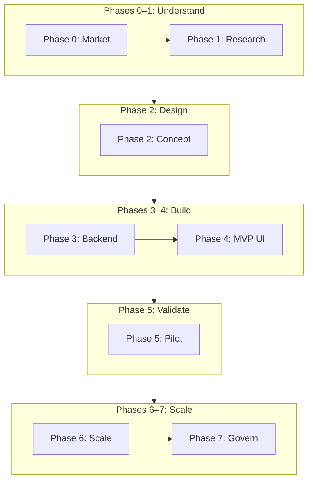
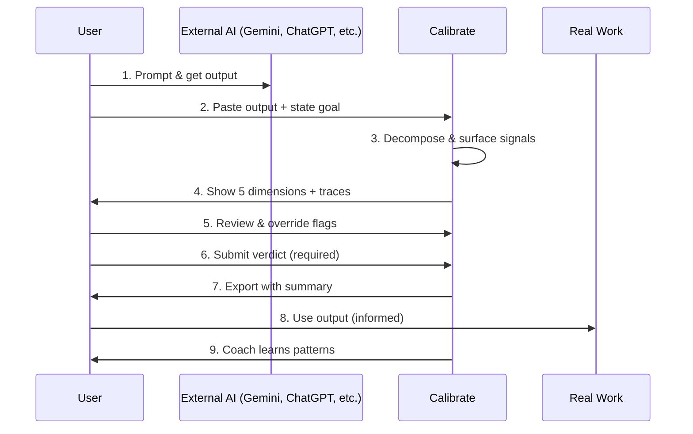
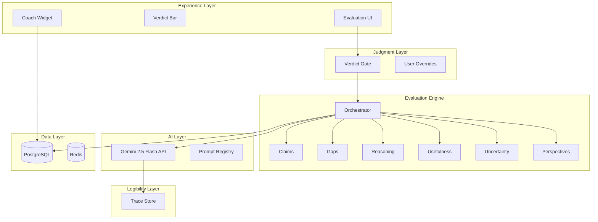
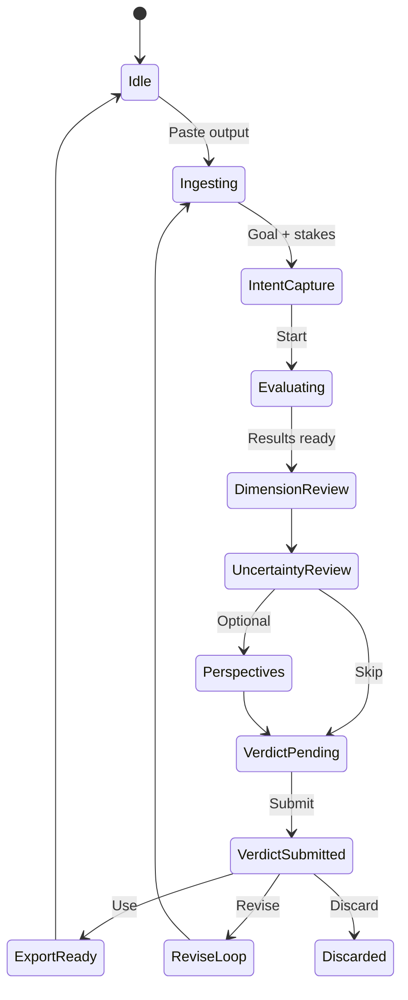
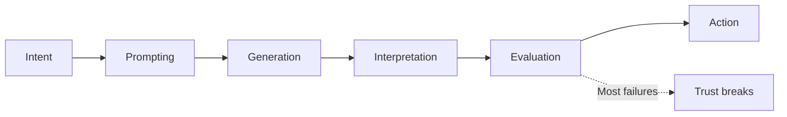
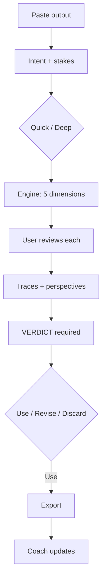
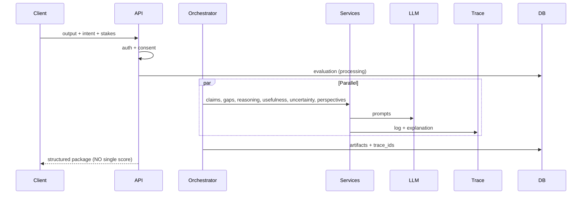
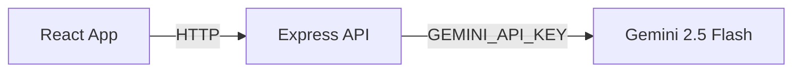

# Calibrate — Master Architecture Document

> **This is the single source of truth for the graduation project.**  
> All phase planning, system design, and build decisions live here.  
> Aligned with: `Gradutaion-problem-statement.md`

| Field | Value |
|-------|-------|
| **Product** | Calibrate — AI Output Evaluation & Confidence Calibration |
| **Version** | 1.1 |
| **LLM** | Google **Gemini 2.5 Flash** (via `@google/generative-ai`) |
| **Frontend** | **React.js** (Vite + TypeScript) |
| **Total timeline** | ~28 weeks (Phases 0–6) + Phase 7 ongoing |

---

## Table of Contents

1. [How to use this document](#1-how-to-use-this-document)
2. [Project overview](#2-project-overview)
3. [Big picture & core product loop](#3-big-picture--core-product-loop)
4. [System architecture (end state)](#4-system-architecture-end-state)
5. [Phase 0 — Discovery](#phase-0--discovery--market-landscape)
6. [Phase 1 — User research](#phase-1--user-research--problem-validation)
7. [Phase 2 — Product design](#phase-2--product-concept--solution-design)
8. [Phase 3 — Backend build](#phase-3--core-platform-build)
9. [Phase 4 — MVP UI](#phase-4--mvp-product-development)
10. [Phase 5 — Pilot](#phase-5--pilot-validation--metrics)
11. [Phase 6 — Scale](#phase-6--iterate-scale--integrate)
12. [Phase 7 — Govern](#phase-7--measure-govern--sustain)
13. [Technical reference](#13-technical-reference)
14. [Graduation checklist & phase tracker](#14-graduation-checklist--phase-tracker)

---

## 1. How to use this document

Each phase uses the same structure:

| Section | What it tells you |
|---------|-------------------|
| **In one sentence** | Phase in plain English |
| **Why it exists** | What breaks if you skip it |
| **What exactly happens** | Step-by-step work |
| **Who / what is involved** | People and systems |
| **Inputs → Outputs** | Artifacts in and out |
| **Architecture status** | What is built vs planned |
| **Exit gate** | Checklist before next phase |
| **Handoff** | What the next phase receives |

**Update the [Phase tracker](#14-graduation-checklist--phase-tracker) as you complete work.**

---

## 2. Project overview

### 2.1 Problem

Users rely on AI for high-stakes tasks (writing, research, career prep), but polished outputs hide weak reasoning, missing context, and subtle errors. Users **over-trust** or become **overly skeptical**; weak work propagates; evaluation skills do not improve.

### 2.2 Solution mandate

| Must do | Must NOT do |
|---------|-------------|
| Evaluate correctness, completeness, reasoning, usefulness, uncertainty | Replace human judgment |
| Surface assumptions, gaps, alternatives | Act as ultimate authority |
| Calibrate confidence over time | Encourage blind trust |
| Make reasoning legible (with traces) | Become an opaque black-box evaluator |
| Accept that "good" is contextual | Use only fact-checking, hallucination detection, or generic trust scores |

### 2.3 Product: Calibrate

A **layer beside AI tools** (not a replacement) that helps humans decide if an output is good enough to use.

| Pillar | What it does |
|--------|--------------|
| **Reasoning X-Ray** | Decompose output into claims, steps, gaps, uncertainties |
| **Calibration Coach** | Learn *user* judgment patterns over time |
| **Human Verdict Gate** | User must explicitly decide before export |

### 2.4 Target segment

| Attribute | Definition |
|-----------|------------|
| **Who** | Knowledge workers, 25–45, AI 3+ times/week |
| **Use cases** | Research synthesis, professional writing, career docs |
| **Unmet need** | "I can't tell if this is good enough to ship" |

### 2.5 Anti-patterns (never build)

- Single opaque trust score  
- Auto-approve without user verdict  
- "AI approved" language  
- Black-box evaluator without traces  

---

## 3. Big picture & core product loop

### 3.1 Phase journey



### 3.2 Timeline

| Phase | Name | Weeks | Cumulative |
|-------|------|-------|------------|
| 0 | Discovery | 2 | Week 2 |
| 1 | User research | 4 | Week 6 |
| 2 | Product design | 3 | Week 9 |
| 3 | Backend build | 4 | Week 13 |
| 4 | MVP UI | 5 | Week 18 |
| 5 | Pilot | 4 | Week 22 |
| 6 | Scale | 6 | Week 28 |
| 7 | Govern | Ongoing | — |

### 3.3 Core user loop (final product)



**Rule:** Calibrate **never** says "this output is approved." The user always decides.

---

## 4. System architecture (end state)

### 4.1 Layered architecture



| Layer | Responsibility |
|-------|----------------|
| Experience | Evaluation UI, onboarding, export |
| Judgment | Verdict gate, user overrides, no auto-approve |
| Evaluation engine | 5 dimensions, parallel services, structured output (no single score) |
| Legibility | Trace per AI signal — "Why am I seeing this?" |
| AI | Gemini 2.5 Flash API, versioned prompts (key server-side only) |
| Data | Users, evaluations, verdicts, traces, calibration |

### 4.2 Five evaluation dimensions

| Dimension | User question | System (assistive) | User must |
|-----------|---------------|-------------------|-----------|
| Correctness | Are claims reliable? | Extract claims | Mark verified/unverified |
| Completeness | What's missing? | Gap vs intent | Accept/dismiss gaps |
| Reasoning | Does logic hold? | Step graph, weak links | Review flagged leaps |
| Usefulness | Can I act on this? | Intent alignment | Decide readiness |
| Uncertainty | What not to assume? | Epistemic/disputed tags | Acknowledge before verdict |

### 4.3 User interaction states



### 4.4 Edge cases

| Case | System | User |
|------|--------|------|
| Conflicting outputs | Side-by-side diff | Pick claims to investigate |
| Incomplete reasoning | Broken link in graph | Decide if acceptable |
| Overconfident AI | Polish warning | Dismiss or investigate |
| Long output (>10k) | Chunked eval | Select sections |
| Subjective domain | Perspectives panel | Verdict allows ambiguity |
| Rushed verdict (<30s) | Soft nudge | Can force with acknowledgment |

### 4.5 Failure modes & mitigations

| Risk | Mitigation |
|------|------------|
| Becomes black box | Trace on every signal; publish methodology |
| Evaluation fatigue | Quick mode; progressive disclosure |
| False authority | "You decide" copy; no AI approve button |
| Over-scaffolding | Coach asks questions; unassisted challenges |
| Under-trust spiral | Stakes-aware sensitivity |
| Privacy breach | Consent tiers; 30-day retention default |
| Metric gaming | Guardrails on deliberation time |

---

## Phase 0 — Discovery & Market Landscape

**Duration:** 2 weeks | **Code:** None

### In one sentence
Study the market to understand **why trust in AI outputs is broken** and what approaches already fail.

### Why it exists
Without this you risk building another fact-checker or trust score — both rejected by the brief.

### What exactly happens

**Week 1:** List AI tools (Claude, ChatGPT, Gemini, Perplexity, Copilot); document how each helps users evaluate outputs; study fact-checkers, citations, explainability; read 5–10 trust/calibration sources; draft hypotheses.

**Week 2:** Write problem framing doc; draw quality vs perceived quality gap; create ethics protocol; build hypothesis backlog (10–15); phase review → approve Phase 1.

### Inputs → Outputs

```
Brief + public sources → competitive analysis → landscape matrix, framing doc, gap analysis, ethics v1, hypotheses
```

### Architecture status

| Layer | Status |
|-------|--------|
| Product | Conceptual only |
| Backend / Frontend | None |
| Research folders | `research/consent/`, `research/instruments/` |

### Exit gate
- [ ] ≥8 competitors analyzed  
- [ ] Quality vs perception gap documented  
- [ ] Ethics protocol approved  
- [ ] ≥10 hypotheses ready  

### Handoff → Phase 1
Hypotheses, ethics protocol, framing doc, anti-patterns list

---

## Phase 1 — User Research & Problem Validation

**Duration:** 4 weeks | **Code:** None

### In one sentence
Talk to and **observe real users** evaluating AI outputs to prove the problem and map where trust breaks.

### Why it exists
Brief requires 6–8 interviews, ≥2 observations, survey n≥30. Turns assumptions into evidence.

### What exactly happens

| Week | Activities |
|------|------------|
| 3 | Finalize interview guide, observation protocol, survey; recruit 10; schedule 4 interviews |
| 4 | Interviews 1–4; **observation 1**; launch survey; affinity mapping |
| 5 | Interviews 5–8; **observation 2**; survey n≥20; journey map draft |
| 6 | Survey n≥30; breakdown heatmap; **choose target segment**; Phase 1 report |

### Six journey stages (observe at each)



| Stage | Typical failure |
|-------|-----------------|
| Intent | Wrong stakes expectations |
| Prompting | Vague prompt → polished wrong output |
| Generation | Assumes "done" = "complete" |
| Interpretation | Skims intro, misses body errors |
| Evaluation | **Polish trap** — trusts fluency |
| Action | Weak output enters real work |

### Breakdown codes

| Code | Meaning |
|------|---------|
| `OVER_TRUST` | Uses without checking |
| `UNDER_TRUST` | Rejects good output |
| `MISSED_GAP` | Doesn't see what's missing |
| `POLISH_TRAP` | "Sounds good" = "is good" |
| `EVAL_FATIGUE` | Stops checking |
| `TOOL_CONFUSION` | Wrong AI expectations |

### Observation session (60 min)

| Time | Activity |
|------|----------|
| 0–5 | Consent; pick real sanitized task |
| 5–10 | User gets AI output in their tool |
| 10–40 | Think-aloud evaluation (you observe) |
| 40–50 | Debrief |
| 50–60 | Code with breakdown taxonomy |

### Exit gate
- [ ] 6–8 interviews synthesized  
- [ ] 2+ observations documented  
- [ ] Survey n ≥ 30  
- [ ] Journey map + segment doc with quotes  

### Handoff → Phase 2
Journey map, breakdown heatmap, segment doc, top 5 insights

---

## Phase 2 — Product Concept & Solution Design

**Duration:** 3 weeks | **Code:** Prototype only (Figma)

### In one sentence
Turn research into **concrete design**: evaluation model, states, metrics, failure critique — before engineering.

### Why it exists
Satisfies brief: ≥3 directions, system flow, states, edge cases, metrics, self-critique.

### What exactly happens

| Week | Activities |
|------|------------|
| 7 | Workshop ≥3 directions; score; wireframes; feedback from 2–3 users |
| 8 | PRD; system diagrams; data flow; state machine; dimension specs |
| 9 | Edge cases; metrics; failure modes (≥8); Figma prototype; sign-off |

### Three solution directions

| Direction | Verdict |
|-----------|---------|
| A. Evaluation Workbench (checklist) | Rejected — rubber-stamp risk |
| B. Reasoning X-Ray (claims + graph) | **Selected (core)** |
| C. Calibration Coach (user patterns) | **Selected (overlay)** |

**Chosen: B + C = Calibrate**

### Designed evaluation flow



### Confidence model

| Level | Who sets it |
|-------|-------------|
| Assistive signal | System + trace |
| Deliberation | User (checkboxes) |
| **Verdict** | **User (required)** |
| Coach insight | System (after 5+ sessions, about *user* bias) |

### Human control rules
1. Export blocked until verdict  
2. Every flag dismissible with reason  
3. Never auto-approve  
4. Every signal has trace  
5. Ambiguity is valid  

### Metrics (defined here, measured in Phase 5)

**North Star — Calibrated Action Rate (CAR):**
```
CAR = (Verdict "ready" AND confirmed appropriate at 7-day follow-up) / (All "ready" verdicts)
```
Target: ≥ 70%

| Leading | Guardrail |
|---------|-----------|
| Eval completion ≥60% | Rubber-stamp >25% |
| Dimensions reviewed ≥4/5 | Abandonment >50% |
| Trace opens ≥40% | False security >15% |

### Exit gate
- [ ] PRD signed off  
- [ ] ≥3 directions + ADR  
- [ ] Flow, states, edge cases, metrics, failures documented  
- [ ] Figma prototype (5+ screens)  

### Handoff → Phase 3
PRD, data flow, dimension specs, state machine, API sketch

---

## Phase 3 — Core Platform Build

**Duration:** 4 weeks | **Code:** Backend + API

### In one sentence
Build the **brain**: services that decompose outputs, surface signals with traces — no polished UI yet.

### Why it exists
Complex engine tested via API before UI coupling.

### What exactly happens

| Week | Build |
|------|-------|
| 10 | `client/` (React) + `server/` (Express), Docker, Postgres, Redis, auth, CI |
| 11 | Gemini adapter (`gemini-2.5-flash`), prompt registry, claims, gaps, orchestrator |
| 12 | Reasoning, usefulness, uncertainty, perspectives, trace store |
| 13 | Ethics middleware, API v1, integration tests, performance baseline |

### API flow: `POST /evaluations`



### Components built

| Component | Phase 3 |
|-----------|---------|
| API + orchestrator + 6 services | ✅ |
| Gemini 2.5 Flash adapter + prompt registry + traces | ✅ |
| Calibration service | ⚠️ Skeleton |
| Web UI | ❌ Phase 4 |

### Exit gate
- [ ] `POST /evaluations` returns full package  
- [ ] 100% signals have `trace_id`  
- [ ] Ethics middleware enforced  
- [ ] CI green; deep mode p95 < 30s  

### Handoff → Phase 4
Stable API, OpenAPI, sample responses, trace endpoint

---

## Phase 4 — MVP Product Development

**Duration:** 5 weeks | **Code:** Full stack

### In one sentence
Build the **React.js app** (`client/`): paste → review 5 dimensions → verdict → export.

### What exactly happens

| Week | Build |
|------|-------|
| 14 | Landing, auth, dashboard, ingest, intent form, mode toggle |
| 15 | 5 dimension tabs, claims, gaps, reasoning graph, usefulness, uncertainty |
| 16 | Trace drawer, perspectives, polish warning, verdict bar, export gate |
| 17 | Coach widget, onboarding, a11y |
| 18 | Dogfood (10+ sessions), bug bash, staging deploy |

### One complete session

| Step | User | System |
|------|------|--------|
| 1 | Sign in | Auth |
| 2 | Paste output | Create evaluation |
| 3 | Enter intent, stakes, domain | Store intent |
| 4 | Click Evaluate | Orchestrator runs |
| 5–8 | Review tabs, open traces, read perspectives | Display artifacts |
| 9 | Submit verdict | `POST /verdict` |
| 10 | Export | Summary file (only if verdict) |

### Screens

| Screen | Route |
|--------|-------|
| Landing | `/` |
| Dashboard | `/dashboard` |
| New evaluation | `/evaluate/new` |
| Evaluation | `/evaluate/[id]` |
| Export | `/evaluate/[id]/export` |

### UX rules (enforced in code)

| Rule | Implementation |
|------|----------------|
| No export without verdict | `exportEnabled = verdictSubmitted` |
| Every flag has trace | Click → `GET /traces/{id}` |
| No auto-approve | No approve button exists |

### Exit gate
- [ ] Full flow on staging  
- [ ] 10+ dogfood sessions  
- [ ] Verdict gate cannot be bypassed  

### Handoff → Phase 5
Staging URL, onboarding, analytics events

---

## Phase 5 — Pilot, Validation & Metrics

**Duration:** 4 weeks | **Users:** 20–30 pilot

### In one sentence
Real users, real tasks — prove Calibrate improves **trust decisions**, not just UX liking.

### What exactly happens

| Week | Activities |
|------|------------|
| 19 | Invite cohort; kickoff; monitor activation |
| 20 | Usage nudges; mid-pilot survey; A/B quick vs deep default |
| 21 | Coach for 5+ session users; interviews; guardrail monitoring; top 3 fixes |
| 22 | 7-day follow-up; calculate CAR; pilot report; go/no-go |

### CAR interpretation

| CAR | Action |
|-----|--------|
| ≥70% | Scale to Phase 6 |
| 50–69% | Iterate, re-pilot |
| <50% | Major redesign |

### Exit gate
- [ ] 20+ users, ≥1 evaluation each  
- [ ] CAR calculated  
- [ ] Go/no-go recorded  

### Handoff → Phase 6
Pilot report, prioritized backlog

---

## Phase 6 — Iterate, Scale & Integrate

**Duration:** 6 weeks

### In one sentence
Fix pilot friction, add Gemini / external AI import, domain packs, extension, open beta (100–500 users).

### What exactly happens

| Week | Focus |
|------|-------|
| 23–24 | Progressive disclosure, domain packs (research, writing, career) |
| 25 | Gemini API integration (native) + paste-from-any-AI |
| 26 | Performance: parallel eval, cache, p95 quick <15s |
| 27 | Chrome extension MVP |
| 28 | Open beta, docs, monitoring |

### Exit gate
- [ ] Top 5 pilot fixes shipped  
- [ ] Gemini integration + 3 domain packs  
- [ ] ≥100 beta users; W1→W2 retention ≥40%  

---

## Phase 7 — Measure, Govern & Sustain

**Duration:** Ongoing (starts Phase 5)

### In one sentence
Operate as a trust product — metrics, guardrails, ethics, prevent opacity drift.

### Operating rhythm

| Cadence | Activities |
|---------|------------|
| Daily | Guardrails, errors, support |
| Weekly | CAR, completion, triage |
| Monthly | Opacity audit, control audit, bias, copy, coach |
| Quarterly | Ethics, retention, roadmap, failure review |

### Guardrail responses

| Alert | Action |
|-------|--------|
| Rubber-stamp >25% | Deliberation nudge; shorten flow |
| Abandonment >50% | Simplify default mode |
| Opacity drift (trust score UI) | **Reject** — violates architecture |

---

## 13. Technical reference

### 13.1 Tech stack

| Layer | Choice |
|-------|--------|
| **Frontend** | **React.js 19** (Vite), TypeScript, React Router, Axios |
| **Styling** | Tailwind CSS |
| **Backend** | Node.js, **Express** |
| **LLM** | **Google Gemini 2.5 Flash** (`@google/generative-ai`) |
| Database | PostgreSQL 16 (Phase 3+) — SQLite optional for local dev |
| Cache | Redis 7 (Phase 6+) |
| Auth | JWT or session (Phase 4+) |
| Analytics | PostHog or Segment (Phase 5+) |
| Infra | Docker, GitHub Actions; client: Vite build / static host; server: Railway/Fly/Render |

### 13.2 Gemini 2.5 Flash configuration

| Setting | Value |
|---------|-------|
| **SDK** | `@google/generative-ai` (Node.js, server only) |
| **Model ID** | `gemini-2.5-flash` |
| **API key** | `GEMINI_API_KEY` in `server/.env` — **never** commit or expose to React client |
| **Provider** | [Google AI Studio](https://aistudio.google.com/apikey) |

**Security rule:** The React app calls **your Express API** only. The API reads `process.env.GEMINI_API_KEY` and calls Gemini. The browser never sees the key.



**Setup (you provide the key):**
1. Copy `server/.env.example` → `server/.env`
2. Set `GEMINI_API_KEY=your_key_here`
3. Run `npm run dev` from project root

### 13.3 Repository structure

```
Graduation Project/
├── ARCHITECTURE.md
├── package.json             # root scripts (dev both apps)
├── client/                  # React.js (Vite)
│   ├── src/
│   │   ├── components/
│   │   ├── pages/
│   │   ├── services/        # API client (no Gemini key here)
│   │   └── App.tsx
│   └── package.json
├── server/                  # Express + Gemini
│   ├── src/
│   │   ├── routes/
│   │   ├── services/
│   │   │   ├── gemini/      # Gemini 2.5 Flash adapter
│   │   │   └── evaluation/  # orchestrator (Phase 3+)
│   │   └── index.ts
│   ├── .env.example
│   └── package.json
├── research/                # Phase 0–1
└── .gitignore
```

### 13.4 Installed libraries (project bootstrap)

**Root:** `concurrently` (run client + server together)

**client/** (`npm install`):
| Package | Purpose |
|---------|---------|
| `react`, `react-dom` | UI |
| `react-router-dom` | Routes (`/`, `/dashboard`, `/evaluate/...`) |
| `axios` | HTTP to Express API |
| `tailwindcss`, `@tailwindcss/vite` | Styling |
| `typescript`, `vite` | Build tooling |

**server/** (`npm install`):
| Package | Purpose |
|---------|---------|
| `express` | REST API |
| `cors` | Allow React dev server origin |
| `dotenv` | Load `GEMINI_API_KEY` |
| `@google/generative-ai` | Gemini 2.5 Flash |
| `typescript`, `tsx` | Run TypeScript |

### 13.5 API v1 (summary)

**`POST /api/v1/evaluations`**
```json
{
  "ai_output": "string",
  "user_intent": "string",
  "stakes_level": 1,
  "domain": "research | writing | career | general",
  "mode": "quick | deep",
  "consent_tier": "standard | sensitive"
}
```

**`GET /api/v1/traces/{trace_id}`** — human-readable explanation

**`POST /api/v1/evaluations/{id}/verdict`**
```json
{
  "trust_level": "low | medium | high",
  "action": "use | revise | discard",
  "rationale": "min 20 chars",
  "dimension_overrides": []
}
```

### 13.6 Data model

```
User → Session → Evaluation
  ├── user_intent, stakes, domain, mode
  ├── claims[], gaps[], reasoning_steps[]
  ├── uncertainties[], perspectives[]
  ├── traces[] (linked)
  └── verdict (required before export)
```

### 13.7 Ethics & retention

| Rule | Implementation |
|------|----------------|
| No sensitive prompt sharing | Redact transcripts; hash in traces |
| Explicit consent | Before interview, observation, pilot |
| Anonymization | Reports only |
| AI output retention | 30 days default; user can delete |
| Trace retention | 30 days; summaries in analytics |

---

## Deployment

This project uses a split deployment strategy: the backend will be exposed via a lightweight Streamlit app (for operations/monitoring and any Python-side orchestration), and the frontend will be deployed as a static Vite site on Vercel.

- **Backend — Streamlit (primary host for operational UI / lightweight service)**
    - Repo path: `server/` — add a `streamlit_app.py` entrypoint that performs health checks and exposes lightweight admin/monitoring pages (or proxies to your Express API if you keep Node for core services).
    - Requirements: add `server/requirements.txt` listing packages (e.g. `streamlit`, any Python monitoring libs). Streamlit Cloud / Streamlit Community Cloud uses `streamlit_app.py` and `requirements.txt` from the repo.
    - Secrets: store `GEMINI_API_KEY` and other secrets in Streamlit Secrets (Settings → Secrets) — do NOT commit keys.
    - Health & readiness: ensure `server/src/routes/health.ts` (or equivalent) returns a compact JSON `{ status, llm, geminiConfigured }` that the Streamlit app can poll and display.
    - Deploy steps (Streamlit Cloud):
        1. Push `server/` and `streamlit_app.py` to GitHub.
        2. Create a new Streamlit app in Streamlit Cloud pointing to the repository and branch; set the app path to `server/streamlit_app.py`.
        3. Add required secrets via the Streamlit UI (`GEMINI_API_KEY`, any DB URLs).
        4. Verify health page and monitoring dashboard load.

- **Frontend — Vercel (static site hosting for `client/`)**
    - Project root on Vercel: set to `client/`.
    - Build command: `npm run build` (from the `client/` directory). Output directory: `dist` (Vite default).
    - Environment variables (set in Vercel project Settings → Environment Variables): set `VITE_API_BASE` (or `REACT_APP_API_URL`) to the production API URL (the Streamlit app's public host or separate API host). The current client uses relative `/api/v1` paths; for production prefer an absolute API base and set it in `client/.env.production` or Vercel env vars.
    - CORS / Proxy: if the frontend is served from a different origin than the API, ensure the backend allows CORS for the frontend origin. Alternatively configure Vercel rewrites to proxy `/api/*` to the backend.
    - Deploy steps (Vercel):
        1. Connect the GitHub repo to Vercel and import the project, choose the `client/` directory as the root.
        2. Set build command and output directory; add `VITE_API_BASE` (production API URL).
        3. Deploy and validate that the UI can reach `VITE_API_BASE/api/v1/health`.

- **CI / CD & rollout**
    - Push-to-main triggers Vercel automatic deploys for the `client/` project.
    - Streamlit Cloud deploys on GitHub pushes to the tracked branch; use protected branches for `main` and `staging`.
    - Use a staging branch (e.g., `staging`) for preview deployments and manual QA before `main` promotion.
    - Health checks: Vercel + Streamlit status pages + basic uptime checks (e.g., GitHub Actions ping) to detect regressions.

- **Secrets & configuration**
    - Store `GEMINI_API_KEY`, DB_CONNECTION, and other sensitive values in the host's secrets manager (Streamlit Secrets, Vercel Environment Variables, or external vault). Never embed keys in the client.
    - Document required env vars in `server/.env.example` and `client/.env.example`.

This section is intentionally concise — tell me if you want a concrete `streamlit_app.py` wrapper, an example `requirements.txt`, or a Vercel `vercel.json` with rewrites and environment examples and I will add them.

## 14. Graduation checklist & phase tracker

### 14.1 Brief → phase map

| Requirement | Phase |
|-------------|-------|
| Market landscape | 0 |
| Business outcomes & trade-offs | 2 |
| User journey map | 1–2 |
| Target segment | 1 |
| 6–8 interviews, 2 observations | 1 |
| Survey n≥30 | 1 |
| Structured 6-stage analysis | 1 |
| ≥3 solution directions | 2 |
| Output evaluation design | 2, 3–4 |
| Uncertainty, confidence, user control | 2, 4 |
| System/data flow | 2–3 |
| Interaction states | 2, 4 |
| Edge cases | 2 |
| Success metrics | 2, 5, 7 |
| Failure critique | 2, 7 |
| Ethical research | 0–1, 5 |

### 14.2 What exists at each phase

| Phase | Code? | Users? | Primary output |
|-------|-------|--------|----------------|
| 0 | No | No | Landscape + ethics |
| 1 | No | Research | Journey map + segment |
| 2 | Prototype | 2–3 informal | PRD + spec |
| 3 | Backend | API testers | Engine + API |
| 4 | Full stack | Dogfood | MVP app |
| 5 | Full stack | 20–30 pilot | CAR + report |
| 6 | + integrations | 100–500 beta | Scaled product |
| 7 | Production | All | Governed ops |

### 14.3 Phase handoffs

| From → To | Carries forward |
|-----------|-----------------|
| 0 → 1 | Hypotheses, ethics, anti-patterns |
| 1 → 2 | Journey map, segment, breakdowns |
| 2 → 3 | PRD, APIs, dimensions, states |
| 3 → 4 | Backend, traces, OpenAPI |
| 4 → 5 | Staging MVP, analytics |
| 5 → 6 | Pilot learnings, backlog |
| 6 → 7 | Production, metrics baseline |

### 14.4 Current progress (update as you work)

| Phase | Status | Started | Completed | Notes |
|-------|--------|---------|-----------|-------|
| 0 | ⬜ Not started | | | |
| 1 | ⬜ Not started | | | |
| 2 | ⬜ Not started | | | |
| 3 | ✅ Complete | | | API, orchestrator, Gemini adapter, and trace store implemented |
| 4 | ✅ Complete | | | Full-stack MVP: evaluation flow, traces, verdict gate, polish warnings, coach preview |
| 5 | 🟡 In progress | | | Pilot runbook and analytics instrumentation added; recruiting and staging next |
| 5 | ⬜ Not started | | | |
| 6 | ⬜ Not started | | | |
| 7 | ⬜ Not started | | | |

*Status: ⬜ Not started · 🟡 In progress · ✅ Complete*

---

*Master document: `ARCHITECTURE.md` · Product: Calibrate · Update this file only.*
